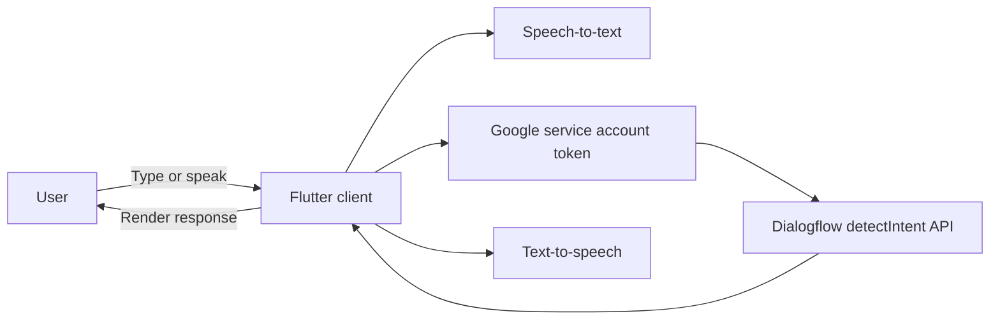

# ISG Assist

[](https://github.com/GarbaJohnAshifa/Amcha-ai-isg/actions/workflows/flutter-ci.yml)
[](LICENSE)

ISG Assist is a Flutter-based conversational assistant designed to answer school-related questions through a chat interface, voice input, and spoken responses.

The app currently integrates directly with Dialogflow via the `detectIntent` API and is structured as a functional prototype for mobile and web.

## Highlights

- Chat UI with message history and timestamps
- Voice input using speech recognition
- Voice output toggle using text-to-speech
- Dialogflow integration for natural language responses
- Quick suggestion chips for common user intents
- Typing indicator while waiting for API response

## Tech Stack

- Flutter / Dart
- `speech_to_text`
- `flutter_tts`
- `http`
- `googleapis_auth`
- Dialogflow API (`projects.agent.sessions.detectIntent`)

## Architecture At A Glance



## Repository Layout

```text
lib/
  main.dart                    # UI, voice flow, API calls, message rendering
assets/
  credentials.json             # Dialogflow service account (development)
  bot_avater.png               # Bot avatar image asset
android/
  app/google-services.json     # Android Firebase/Google services config
ios/
web/
test/
  widget_test.dart             # Template test (not aligned with current UI)
```

## Prerequisites

- Flutter SDK compatible with Dart `^3.6.0`
- A Google Cloud project with Dialogflow enabled
- A Dialogflow agent configured for your intents

## Quick Start

1. Install dependencies.

```bash
flutter pub get
```

2. Add your service account JSON file to `assets/credentials.json`.

3. Confirm `projectId` in `lib/main.dart` matches your Dialogflow project.

4. Run the app.

```bash
flutter run
```

## Configuration

Application-specific runtime values are currently in `lib/main.dart`:

- `projectId`: Dialogflow project identifier
- `sessionId`: static session key used for `detectIntent`
- `suggestions`: quick prompt chips shown in the UI

For multi-user or production behavior, session handling should be dynamic and managed server-side.

## Development Commands

```bash
flutter analyze
flutter test
```

## Security Notes

- `assets/credentials.json` must not contain real production credentials in public repositories.
- Embedding service account credentials in a client app is acceptable only for local development or controlled demos.
- For production, move Dialogflow calls to a backend service and issue short-lived, scoped tokens to clients.

## Platform Notes

- Android microphone and network permissions are configured in `AndroidManifest.xml`.
- iOS release builds should include the required microphone/speech usage description keys in `Info.plist`.

## Known Gaps

- Core logic is concentrated in `lib/main.dart`; feature-based modularization is recommended.
- Automated tests are still template-level and do not validate chat, speech, or API behavior.
- There is an asset naming inconsistency between `assets/bot_avater.png` and code references that should be normalized.

## Suggested Next Steps

1. Split API/auth/state management from UI into dedicated layers.
2. Replace client-side service account auth with backend mediation.
3. Add widget tests for message rendering, input flow, and loading states.
4. Add integration tests for voice input and API response handling.

## Contributing

1. Fork the repository.
2. Create a feature branch.
3. Run `flutter analyze` and `flutter test` before opening a PR.
4. Submit a pull request with a clear scope and test notes.

## Screenshots

Add screenshots or GIFs under `docs/images/` and reference them here.

Example:

```md


```

## License

This project is licensed under the MIT License. See `LICENSE` for details.
